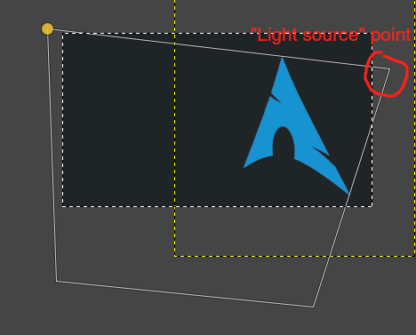
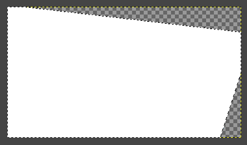
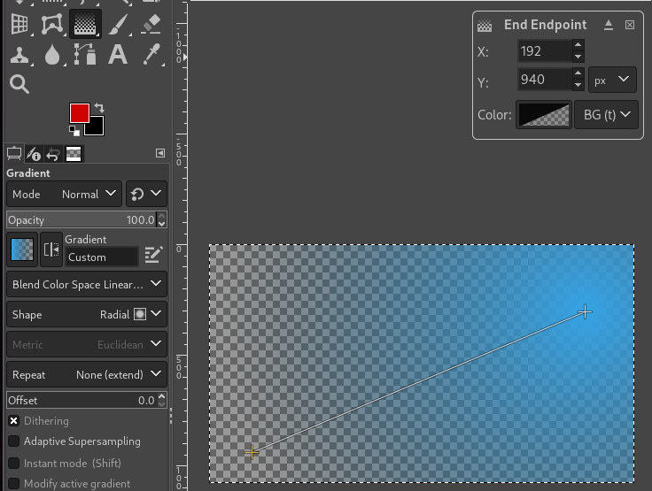
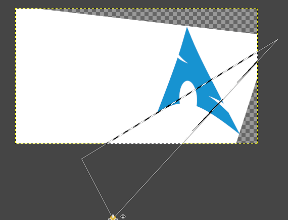

# Creating a wallpaper like the Windows one, in Gimp

The program I used to make this is "Gimp", which is like photoshop but free and open-source.

Here is what the final product looks like:

I started with this source image which I found on the internet:

First, I cut out the arch logo, moved it to a different layer, and applied a 3d transform (Tools->Transform Tools->3D Transform) to tilt it to one side, and darkened and desatured the background with Colors->Hue-Saturation:

My next step was the light effect with shadows. I started by using the free select tool to fill in the "light" effect by making a triangle with the sides of the logo and a "light source" point:

Then I added a new layer, added a transparency mask (right click the layer, then click "Add Layer Mask") to the layer, and filled in the selection with white (make sure you have the layer mask selected for this part). 

Then, I selected the new layer itself(not the transparency mask) and added a new gradient using Tools->Paint Tools->Gradient. I selected the left endpoint and made it transparent using the dialog box in the top right, and selected the color of the gradient on the right endpoint.

After that I added the shadows to the transparency mask using the free select tool, and deleting the areas of the "light source" where the shape would be casting a shadow. I made a triangle with one vertex about where the "light source" point was before, and the two edges coinciding with the edges of the parts of the logo shape that would cast a shadow.

After that, I got rid of the parts of the "light" transparency mask that were behind the logo, colored the logo a bit differently, and put the layers on top of each other in this order: light -> logo -> background.

And, that's it! Feel free to download the xcf file here: https://github.com/EricPedley/ericpedley.github.io/blob/main/images/gimp-wallpaper-blog/arch-window-bg.xcf?raw=true and customize it yourself!
